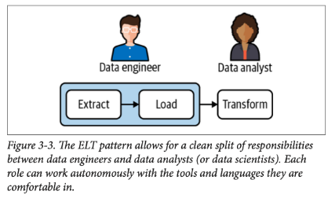
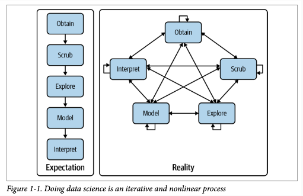

# Information processing

#### Distinguish between data, metadata, and information.

**Data** is a measurement of something on a scale and it is a fact known by direct observation.

**Metadata** is "*data about data*". It is not the content of data, but data providing information about one or more aspects of data, such as: 
- description (date, time, author)
- structure (format, version)
- administrative (permissions)
- legal
- ...

**Information** is data with a context/meaning, thus enabling decision making. It is data that has been processed organized and structured.

####  Identify and describe the phases of a typical information life cycle.

The life cycle of information typically includes the following phases:

- **Occurrence**: discover, design, author, etc.
- **Transmission**: networking, accessing, retrieving, transmissing, etc.
- **Processing and Management**: collecting, validating, modifying, indexing, classfying, filtering, sorting, storing, etc.
- **Usage**: monitoring, explaining, planning, forecasting, decision-making, educating, learning, etc.

####  Describe typical data processing patterns, pipelines and frameworks, e.g. ETL, EtlT, OSEMN.

###### ETL

The **ETL** framework (extract-transform-load) is usually associated with classic centralized IT driven operations.

- **Extract**: involves extracting data from the source system
- **Transform**: a series of operations or transformations are applied to extract the data
- **Load**: involves publishing data to the target system, either simple flat files or other infrastructures

###### EtLT

**EtLT** is a sub-pattern that introduces a transformation step before loading, typically associated with data cleaning tasks

###### OSEMN

The **OSEMN** ("awesome") framework was *coined* in the context in the context of data sciece. OSEMN means:

- **Obtain**: gathering data
- **Scrub**: clear, arrange and prepare data
- **Explore**: observe, experiment and visualize
- **Model**: create a statistical model of the data
- **Interpret**: drawn conclusions, evaluating and communicating results

As it is presented in the previous picture, in real-world systems, it is not a linear process but, instead, an iterative one.

####  Describe the challenges associated with data processing.

Some common problems which affect data quality, therefore affecting data processing, are:
- **Missing data** - due to error, specific meaning (e.g. NA, 0, NULL) 
- **Inconsistent values** - distinct timezones in times/dates, multiple units (e.g. m, km, etc.)
- **Precision problems** - rounding decisions may result in fake patterns (e.g. maps)
- **Duplicate values** - due to errors, or valid data
- **Others** - text encoding problems, mislabeled data, incomplete, outdated, etc.

**Outliers** are might be a specific example of inconsistent values. They are items that differ significantly from others. It is necessary to understand if they are expections, but valid or errors that must be removed and, for that, it is necessary to have knowledge in the problem's domain. They might be a result of problems during the data collection phase, hardware or software problems from data collecting tools or even (probably the most common scenario) from human induced mistakes in data recording.

**Missing Data** is also an important aspect that might highly affect data quality and needs to be investigated, because it might be a strong indicator that there were flaws in the data collection process. 

There are various strategies to try to mitigate these issues, such as investigating and understanding data properties during the data selection phase - data investigation/assessment.

####  Identify and describe challenges and techniques related to: data cleaning, data preparation, and data presentation.

###### Data Cleaning 

###### Data Preparation

Data Preparation captures activities like:
- Understand what data is available
- Choose what data to use and at what level of detail
- Understand how to combine multiple sources of data
- Deciding how to distill the results to a size and shape that enables the follow-up steps.

Common data preparation tasks include:
- **Data cleaning** - identify and fix data quality issues
- **Data transformation** - transform data to improve analysis or manipulation
- **Synthesis of data** - create new attributes derived from existing data
- **Data integration** - combine data from different sources
- **Data reduction or selection** - eliminate data from the collection

###### Data Presentation

Data Presentation is an important task in data projects. It can vary a lot depending on the target audience and is a great tool to evaluate data quality issues.

Data visualization is used for this and it can be divided in two categories: exploration and explanation

- Exploration: generally done at a higher level of granularity, earlier in the process, and the main goal is to understand what is in the data.
- Explanation: appropriate when you already know the data and want to support current finding.

Commondata visualization solutions are:
- charts
- time-series
- maps
- interactive
- words

####  Describe the importance of data pipelines and how Makefiles can be used to implement them.

Data pipelines are sets of processes that move and transform data from various sources to various destinations where a new value can be derived.

Data collection and preparation are usually an ad-hoc and exploratory process, which might easily lead to a dispersion in threads and activities. For this, adopting a pipeline management system and documenting how to use it is the solution.

**Makefiles** are used to automate software build processes, by defining targets and rules to execute. Some tasks might depend on the execution of others to start running, which is a normal scenario for pipelines.