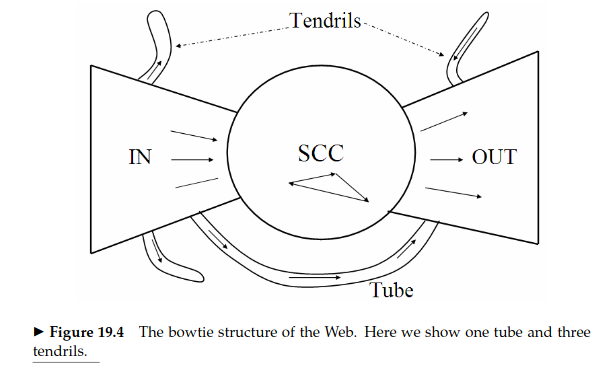

# Web Search

#### What are informational, transactional and navigational information needs?

#### Name some differences between web search and enterprise search.

##### Scope and Purpose

###### Web Search

Web search engines, such as Google, Bing, and Yahoo, are designed to index and retrieve information from the vast and diverse content available on the World Wide Web. The goal is to provide relevant results to a broad audience.

###### Enterprise Search

Enterprise search is focused on retrieving information within a specific organization or enterprise. It aims to help employees find relevant documents, data, and information stored within the company's intranet, databases, and other internal systems.

##### Content Source

###### Web Search

Indexes content from publicly accessible websites and pages on the internet.

###### Enterprise Search

Indexes content from internal sources, including company databases, intranet sites, shared drives, documents, emails, and other proprietary systems.

##### Access Control and Security

###### Web Search

Primarily deals with publicly accessible content and doesn't typically involve user authentication or access control.

###### Enterprise Search

Requires robust access controls and security measures to ensure that users only have access to information for which they have permission. It often integrates with existing enterprise security systems.

##### Content Structure

###### Web Search

eals with a wide variety of content types, including web pages, images, videos, and more. Content on the web is often unstructured.

###### Enterprise Search

Involves structured and unstructured data, such as documents, databases, spreadsheets, and other business-related content. The content is often specific to the organization's business processes.

##### Scale

###### Web Search

Deals with a massive scale, indexing and retrieving information from billions of web pages across the entire internet.

###### Enterprise Search

Operates on a smaller scale, focusing on the information within the organization.

#### How do you index images?

#### Give examples of ranking signals used by search engines.

#### What are the SCC, IN and OUT components in the view of the web as a bowtie?

The view of the web as a bowtie is a conceptual model used to represent the structure of the World Wide Web and its connectivity. It was introduced by researchers as a way to understand the global structure of the web. In this model, the web is visualized as a bowtie shape with different components. Three key components are often identified: SCC (Strongly Connected Component), IN, and OUT.

**1. Strongly Connected Component (SCC):**
- The SCC represents a group of web pages where there is a path from any page in the component to any other page, meaning that there is bidirectional connectivity among the pages within the component.
- SCCs are considered the core or central part of the web structure, representing densely connected clusters of web pages.

**2. IN Component:**
- The IN component consists of web pages that can reach the SCC but cannot be reached from the SCC. In other words, pages in the IN component have incoming links from the SCC, but there is no backlink from the SCC to these pages.
- The IN component is often associated with pages that provide information or resources that are relevant to the central core represented by the SCC.

**3. OUT Component:**
- The OUT component consists of web pages that can be reached from the SCC but do not have links pointing back to the SCC. These pages can be considered as pages that are reachable from the central core but may not contribute to the core's structure.
- The OUT component is often associated with pages that represent different topics, applications, or services that extend outward from the central core.

"There are three major categories of web pages that are sometimes referred to as IN, OUT and SCC. A web surfer can pass from any in IN to any page in SCC, by following hyperlinks. Likewise, a surfer can pass from page in SCC to any page in OUT. Finally  the surfer can surf from any page in SCC to any other page in SCC. However, it is not possible to pass from a page in SCC to any page in IN, or from a page in OUT to a page in SCC (or, consequently, IN). Notably, in several studies IN and OUT are roughly equal in size, whereas SCC is somewhat larger; most web pages fall into one of these three sets. The remaining pages form into tubes that are small sets of pages outside SCC that lead directly from IN to OUT, and tendrils that either lead nowhere from IN or from nowhere to OUT."

