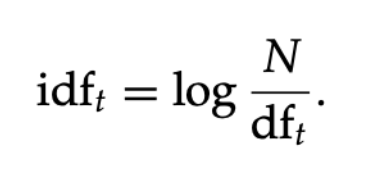
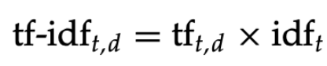
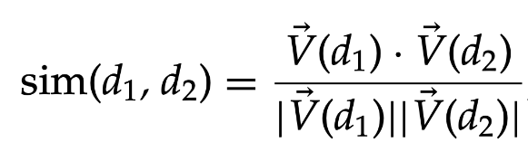

# Vector Model

#### What is the bag of words model for a document?
A Bag of Words (BoW) representens text as an unordered collection of words, disregarding grammar and word order. BoW simplifies text into term frequency counts for each document.

E.g.: 

If the document contained the sentence "'Good dog, good dog!', said the quick brown fow." 
The BoW representation would be 

```json
{
    "good": 2,
    "dog": 2,
    "said": 1,
    "the": 1,
    "quick": 1,
    "brown": 1,
    "fox": 1
}
```

Even though this method is simple, efficient and has built-in word independence, you will get loss of context, semantic gaps and sparsity using it. 


#### What is… term frequency, collection frequency, document frequency, inverse document frequency?

###### Term Frequency

**Term Frequency** (`tf(t,d)`) is the number of mentions of a term on a document.


- The simplest form of weighting terms differently is simply to assign the weight of a term to the term's frequency.

###### Collection Frequency

**Collection Frequency** of a term (`cf(t)`) is the total number of times a term appears in the document collection.


###### Document Frequency

**Document Frequency** (`df(t)`) is the number of documents that contain a term.


###### Inverse Document Frequency

**Inverse Document Frequency** (`idf(t)`) incorporates the weight of a term.



- N is the total number of documents in the collection.
- The rarer the term in a collection, the higer its idf.

#### How do you calculate tf-idf weights?

TF-IDF (Term Frequency-Inverse Document Frequency) representation assigns a weight to each term in a document based on its frequency in the document and rarity across the entire corpus.



###### Notes

- tf-idf is the highest when the term occurs many times within a small number of documents.
- tf-idf is lower when the term occurs fewer times in a document, or occurs in many documents.
- tf-idf is the lowest when the term occurs in virtually all documents.

#### How do you rank documents in the vector model?

The **vector space model** represents a set of documents as vectors in a common vector space.

Queries an also be represented as vectors in a n-dimensional space, being n the number of terms in the query. You can imagine queries as very short documents.

Each document is represented as a vector, with a component vector for each dictionary term. tf-idf weights are used as component weights.

`Reminder`: TF-IDF assigns higher weights to terms that are frequent in the document but not common across all documents.

In the vector model, the similarity between a document vector and a query vector is used to rank documents based on their relevance to the query. The common method for calculating this similarity is through the use of the cosine similarity measure.

###### Cosine Similarity

- Cosine similarity measures the cosine of the angle between two vectors and is used to determine the similarity between the document vector and the query vector.

- The cosine similarity (cos θ) between two vectors A and B is calculated using the dot product of the vectors:

```
cosine similarity = A * B / (||A|| * ||B||)
```

- The result is a value between -1 and 1, where 1 indicates perfect similarity and -1 indicates perfect dissimilarity.



###### Ranking

- Documents are ranked based on their cosine similarity with the query vector. Higher the cosine similarity values correspond to higher relevance to the query.

#### Short answer:

The top ranked results for a given query are thus the documents whose vectors have the highest cosine similarity in comparison with the query vector.