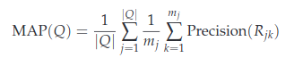

# Evaluation

# Evaluation

#### What is… precision, recall, interpolated precision?

###### Precision

**Precision** is the fraction of retrieved documents that are relevant:

```
Precision = #(relevant items retrieved) / #(retrieved items) = P(relevant|retrieved)
```

###### Recall

**Recall** is the fraction of relevant documents that are retrieved:

```
Recall = #(relevant items retrieved)/#(relevant items) = P(retrieved|relevant)
```

###### Extra

|               | Relevant             | NonRelevant          |
| ------------- | -------------------- | -------------------- |
| Retrieved     | True Positives (tp)  | False Positives (fp) |
| Not Retrieved | False Negatives (fn) | True Negatives (tn)  |

Then:

```
# Precision
P = tp / (tp + fp)

# Recall
R = tp / (tp + fn)
```

###### Interpolated Precision

The interpolated precision `p_interp` at a certain recall level `r` is defined as the highest precision found for any recall level `r' >= r`

#### What is… precision at k, R-precision?

###### Precision at k

The previous measures factor in precision at all recall levels. For many prominent applications, particularly web search, this may not be germane to users. What matters is rather how many good results there are on the first page or the first three pages. This leads to measuring precision at fixed low levels of retrieved results, such as 10 or 30 documents. This is referred to as "Precision at k", for example "Precision at 10". It has the advantage of not requiring any estimate of the size of the set of relevant documents but the disadvantages that it is the least stable of the commonly used evaluation measures and that it does not average well, since the total number of relevant documents for a query has a strong influence on precision at k.

E.g.: `R R N N R N R R R R`

-   `P@5 = 0.6`
-   `P@10 = 0.7`

###### R-Precision

An alternative to the previous measure, which alleviates this problem, is R-Precision. It requires having a set of known relevant documents _Rel_ documents returned. (The set _Rel_ may be incomplete, such as when _Rel_ is formed by creating relevance judgements for the pooled top k results of particular systems in a set of experiments). R-Precision adjusts for the size of the set of relevant documents: A perfect system could score 1 on this metric for each query, whereas, even a perfect system could only achieve a precision at 20 of 0.4 if there were only 8 documents in the collection relevant to an information need. Averaging this measure across queries thus makes more sense. This measure is harder to explain to naive users than Precision at k but easier to explain than MAP. If there are |_Rel_| relevant documents for a query, we examine the top |_Rel_| results of a system, and find that _r_ are relevant, then by definition not only the precision (hence the R-Precision) _r_ / |_Rel_|, but the recall of this result set is also _r_ / |_Rel_|.

#### Name the components of a test collection.

#### Why is a set of relevance judgements considered a “ground truth” for IR?

A set of relevance jugments is considered "ground truth" in IR because it provides an objective and standardized measure of document relevance serving as the benchmark against which the performance of IR systems are evaluated.

"
Information retrieval system evaluation
To measure ad hoc information retrieval effectiveness in the standard way,
we need a test collection consisting of three things:

    1. A document collection
    2. A test suite of information needs, expressible as queries
    3. A set of relevance judgments, standardly a binary assessment of either

relevant or nonrelevant for each query-document pair.
The standard approach to information retrieval system evaluation revolves
around the notion of relevant and nonrelevant documents. With respect to a
user information need, a document in the test collection is given a binary
classification as either relevant or nonrelevant. This decision is referred to as
the gold standard or ground truth judgment of relevance. The test document collection and suite of information needs have to be of a reasonable size:
you need to average performance over fairly large test sets, as results are
highly variable over different documents and information needs. As a rule
of thumb, 50 information needs has usually been found to be a sufficient
minimum.
"

#### Draw a precision-recall curve for capturing the evolution of precision in the ranked list of results for a query.

-   For each step calculate the Precision and the Recall values using the formulas above.

-   Create a graph where the Y-axis is the Precision value and the X-axis is the recall

-   Place each (recall, precision) point in the graph and draw a line to unite them (optional)

#### What is an average 11-point precision-recall graph for a set of queries?

Instead of examining the entire PR-Curve, a common practice is to evaluate the system at specific points, These points are typically selected at different recal levels (0.0, 0.1, 0.2,..., 1), and the corresponding precision values are recorded.

For each information need, the interpolated precision is measured at 11 recall levels (From 0.0 to 1.0). For each recall level we then calculate the arithmetic mean of the interpolated precision at that recall level for each information need in the test collection. A composite PR curve showing 11 points can then be graphed.

#### What is MAP, and do you calculate it for a set of queries in a test collection?

**Map** stands for Mean Average Precision and it is the most standard measure accros the TREC community. MAP provides a single-figure measure of quality across recall levels. Among evaluation measures, MAP has been shown to have especially good discrimination and stability.

For a single information need, Average Precision (AvP) is the average precision of value for the set of top k documents existing after each relevant document is retrieved, and this value is then averaged over information needs. That is, if the set of relevant documents for an information need q_j ∈ Q is {d1, . . . d_m_j } and R_jk is the set of ranked retrieval results from the top result until you get to document d_k, then



When a relevant document is not retrieved at all, the precision value in the above equation is taken to be 0. For a single information need, the average precision approximates the area under the uninterpolated PR-curve, and so the MAP is roughly the average area under the PR-Curve for a set of queries.

Using MAP, fixed recall levels are not chosen and there is not interpolation. The MAP value for a test collection is the arithmetic mean of average precision values for individual information needs. (This has the effect of weighting each information need equally in the final reported number, even if many documents are relevant to some queries whereas very few are relevant to other queries.) Calculated MAP scores normally vary widely across information needs when measured within a single system, for instance, between 0.1 and 0.7. Indeed, there is normally more agreement in MAP for an individual information need across systems than for MAP scores for different information needs for the same system, This means that a set of test information needs must be large and diverse enough to be representative of the system effectiveness across different queries.

###### Short Answer

Average Precision (AvP) provides a single-figure measure of quality across recall levels for a single query.

For a single information need, AvO is the average of the precision value obtained for the set of top k documents existing after each relevant document is retrieved

Given a set of queries, the MAP value is the mean over the AvP values.
