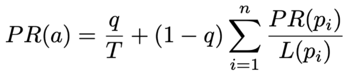
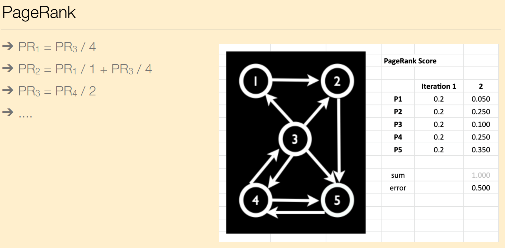
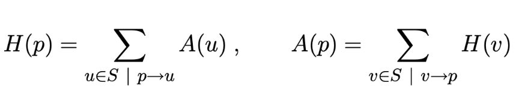
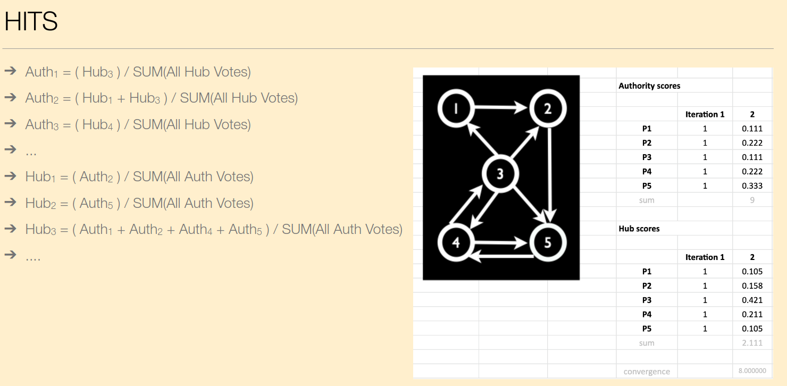

# Link Analysis

#### What are in-links and out-links for a web page?

**In-Links (Inbound Links)** are the hyperlinks on other web pages that direct users to the specific web page in question. In-Links are essentially incoming connections from external sources.

**Out-Links (Outbound Links)** are the hyperlinks present on the webpage itself that point to other pages on the internet. Out-Links serve to connect the content of the current page to related or referenced information elsewhere. The way a page links to other reputable sources can influence its own credibility. Additionally, out-links contribute to the overall structure of the web, by creating a network of interconnected content.

#### How is anchor text used in web search?

Anchor Text helps search engines understand the content and context of linked pages. Relevant keywords in anchor text contribute to a page's ranking for those terms. Diverse and natural anchor text is preferred, while suspicious patterns may lead to penalties. Overall, anchor text is a vital signal for search engines to assess a page's relevance and authority.

- Anchor text represents a description "from others" about a given web page.

- The collection of all anchor texts can be explored with standard IR techniques, and incorporated as an additional feature in an inverted index.

#### Calculate PageRank values for a set of linked documents.

- PageRank is a query-independent value (between 0 and 1) computed offline that only depends on the structure of the web graph.

- PageRank is a process of distributing importance among linked documents, iterating until a stable ranking is achieved. The algorithm considers the number and quality of links to determine the significance of each document in the network.

###### Calculating PageRank

- **Initialize:** Start by assigning an equal PageRank value to all linked documents in the set.

- **Calculate Outgoing Links:** Determine the number of outgoing links from each document. This information is used to distribute PageRank.

- **Distribution:** Share the PageRank value of each document equally among its outgoing links. The more links a document has, the less PageRank each link receives.

- **Iteration:** Repeat the process for several iterations, recalculating PageRank values each time. This helps converge towards stable and accurate PageRank scores.

- **Convergence Check:** Monitor changes in PageRank values after each iteration. Stop iterating when the values stabilize, indicating the convergence of PageRank scores.

- **Final PageRank:** The stabilized PageRank values represent the calculated importance or relevance of each document in the set based on the link structure.

###### Example

#### Calculate Hub and Authority values for a set of linked documents.

- HITS (Hyperlink-Induced Topic Search) algorithm calculates Hub and Authority values iteratively, considering the interplay between linked documents. Hubs point to valuable content, and authorities are valuable content, creating a mutually reinforcing relationship.

- Pages with many links pointing to them are called **authorities**.
- Pages with many outgoing links are called **hubs**.

###### Calculating 

- **Initialize:** Assign an initial Hub score and an initial Authority score to each document in the set (can be 1).

- **Calculate Hubs:** For each document, sum the Authority scores of its linked documents. Update the Hub score for each document based on these sums.

- **Normalize Hubs:** Scale down Hub scores to prevent overly influential hubs. Normalize the Hub scores by dividing each by the sum of their squares.

- **Calculate Authorities:** For each document, sum the Hub scores of the documents that link to it. Update the Authority score for each document based on these sums.

- **Normalize Authorities:** Scale down Authority scores to prevent overly influential authorities. Normalize the Authority scores by dividing each by the sum of their squares.

- **Iteration:** Repeat steps 2-5 for several iterations until Hub and Authority scores converge to stable values.

- **Convergence Check:**  Monitor changes in Hub and Authority scores after each iteration. Stop iterating when the values stabilize, indicating convergence.

- **Final Hub and Authority Scores:** The stabilized Hub and Authority scores represent the calculated importance of each document in terms of being a hub (pointing to valuable content) or an authority (being valuable content).

###### Example

