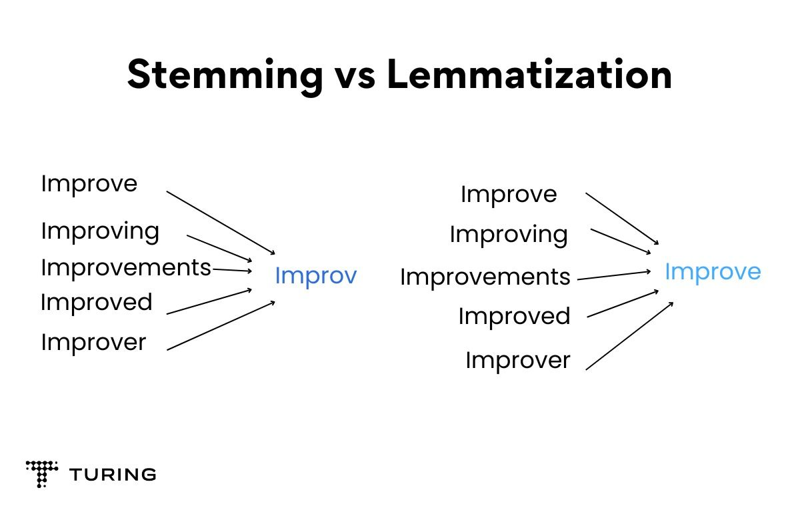
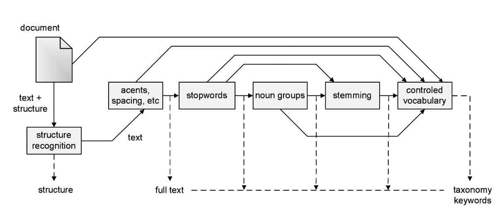

# Notes

## Relevance

A relevant document contains information that satisfies the information need of the user that submitted a query to the search engine.

## Evaluation

### Effectiveness vs Efficiency

**Effectiveness** measures the ability of a search system to find the right information.

**Efficiency** measures how quickly a search system provides an answer.

## Information Retrieval Overview

### Boolean Model

- In the Boolean Retrieval Model queries are represented in the form of a Boolean expression of terms.

### Incidence Matrix

|        | Antony and Cleopatra | Julius Caesar | ... |
| ------ | -------------------- | ------------- | --- |
| Antony | 1                    | 1             | ... |
| Brutus | 1                    | 1             | ... |
| Caesar | 1                    | 1             | ... |
| mercy  | 1                    | 0             | ... |
| ...    | 1                    | 1             | ... |

A term-document incidence matrix. Matrix element (t, d) is 1 if the play in column d contains the word in row t, and is 0 otherwise.

### Tokenization

-   "A token is an instance of a sequence of characters in some particular document that
    are grouped together as a useful semantic unit for processing."
-   "A type is the class of all tokens containing the same character sequence."

### Stop Words

Stop words are words considered of little value in helping select documents in the retrieval process, e.g. a word that exists in all documents. (e.g.: "a", "an", ...)

### Token Normalization

"Token normalization is the process of canonicalizing tokens so that matches occur despite superficial differences in the character sequences of the tokens.". (e.g.: capitalization, stemming, lemmatization, etc.)

### Stemming

Stemming refers to a heuristic process that chops off the ends of words in the hope of reducing inflectional forms.

### Lemmatization

Lemmatization refers to the process of reducing inflectional forms by using vocabularies and the morphological analysis of words to find its lemma.

### From full text to index terms

### Ranked Retrieval

- With the Boolean model, a document either matches or does not match a query.

- In large document collections this is not feasible, thus it is essential for a search system to rank-order the documents.

- If recall is an important metric, Boolean Model might still be used (e.g.: patent search).